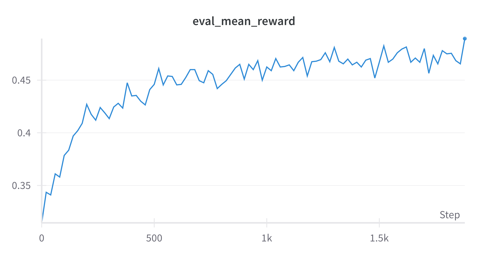
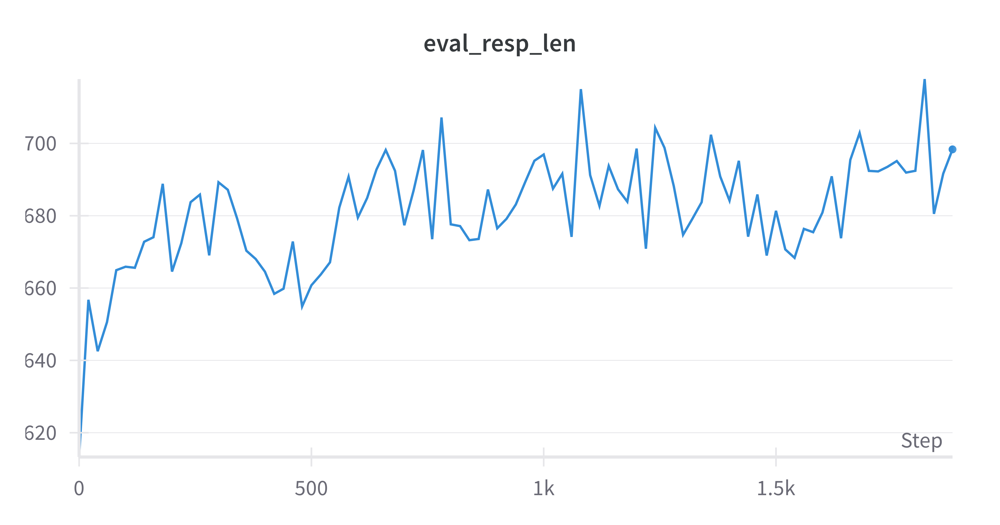

# nanoR1Zero

最小版本复现deepseek R1 Zero
1. Base model： qwen-1.5b-instruct
2. Prompt: 8k math problems
3. Eval: Math 500

## 训练

```bash
python script/main.py script/conf.json
```

## 测试集效果
1. 测试集rewards稳定提升


2. 测试集序列长度持续变长

